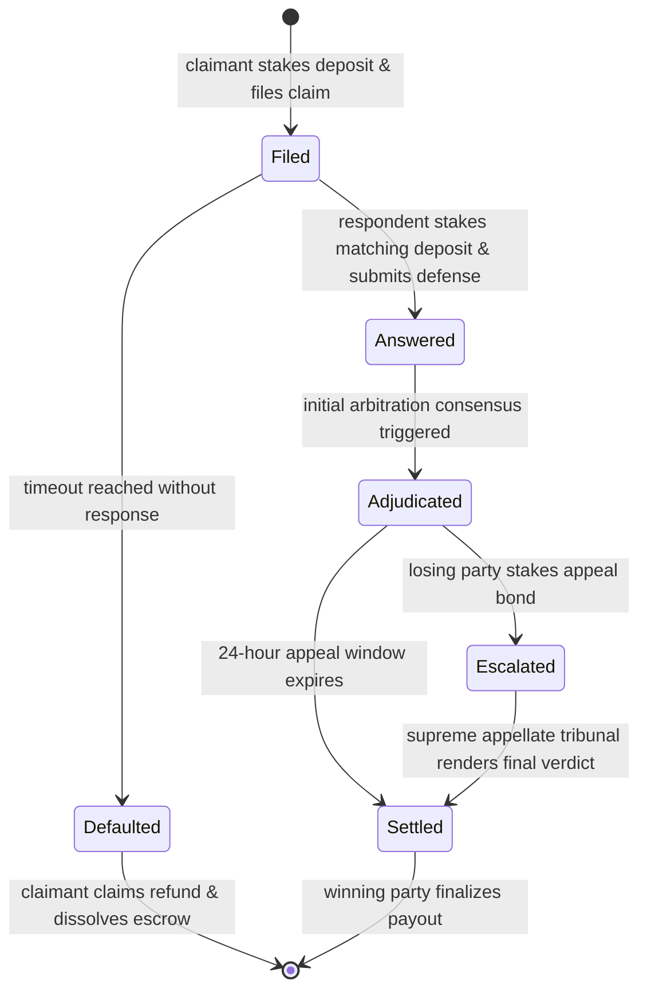

# 🏛️ GenGavel: Decentralized Agreement Arbitration & Escrow Protocol

GenGavel is a trustless, decentralized court system and SLA (Service Level Agreement) enforcement protocol. Built on GenLayer, GenGavel enables contract execution, escrow protection, and qualitative dispute resolution through decentralized AI validator consensus. It allows counterparties to enter agreements with subjective milestones (such as custom software development, creative design, or service standards) and guarantees fair, decentralized, and economic adjudication if conflicts arise.

---

## 📖 Table of Contents
1. [Core Mission & Use Cases](#-core-mission--use-cases)
2. [Protocol Architecture & Economic Safeguards](#-protocol-architecture--economic-safeguards)
3. [The Dispute Resolution Lifecycle](#-the-dispute-resolution-lifecycle)
4. [Smart Contract Technical Specifications](#-smart-contract-technical-specifications)
5. [consensus & The Equivalence Principle](#-consensus--the-equivalence-principle)
6. [Sandboxed Setup & Local Sandbox](#-sandboxed-setup--local-sandbox)

---

## 🎯 Core Mission & Use Cases

Traditional blockchains cannot enforce agreements containing subjective or qualitative clauses. If a developer delivers a code milestone that "functions poorly" or a designer creates an asset that "breaches style guidelines," smart contracts cannot arbitrate the claim because subjective criteria cannot be expressed in binary code.

GenGavel bridges this gap. By utilizing GenLayer’s LLM-driven validators, the protocol reaches consensus on natural-language briefs, complaints, and evidence. 

### Ideal Scenarios:
* **Freelance Milestones:** Ensuring deliverables match qualitative client briefs.
* **SLA Enforcement:** Verifying server uptime and qualitative service standards.
* **E-Commerce Escrows:** Confirming that goods delivered match their description.

---

## 🛡️ Protocol Architecture & Economic Safeguards

Arbitration protocols are vulnerable to systemic manipulation, griefing, and host clock exploits. GenGavel addresses these game-theoretic risks with a series of design safeguards:

### 1. Spam Prevention (Stake-Matching)
To file a case, the claimant must lock a specified stake (escrow deposit). To defend themselves, the respondent must match that stake. The prevailing party claims the entire merged escrow pool. This ensures both parties have equal financial stakes and prevents frivolous complaints.

### 2. Lockup Prevention (Default Judgments)
If a respondent refuses to file a defense, the claimant's funds could remain trapped. GenGavel introduces a customizable response timeout. If the respondent fails to submit their rebuttal before the deadline, the claimant can execute a default judgment to reclaim their initial stake.

### 3. Escrow Security (Appeals Window)
Initial rulings do not immediately transfer funds to the winning address, preventing immediate "wallet clawback" issues. Instead, rulings are placed in a 24-hour pending escrow. The losing party may challenge the decision by staking a matching appeal bond to escalate the case.

---

## 🔄 The Dispute Resolution Lifecycle

The diagram below details the operational stages of a dispute within the GenGavel protocol, showcasing the paths from initial filing to final resolution:



---

## 📑 Smart Contract Technical Specifications

### Core State Properties:
* `dispute_count (i32)`: Auto-incrementing identifier for disputes.
* `charter (str)`: The natural-language rules and regulations of the DAO/Court.
* `disputes (TreeMap)`: Map of serialized dispute data records.

### Contract API Interface:

```python
# Lodge a new claim and lock the initial escrow stake
lodge_dispute(title: str, complaint: str, evidence: str, defendant: str, duration_hours: int) -> i32

# File a defense narrative and lock a matching escrow stake
submit_rebuttal(dispute_id: str, rebuttal: str, evidence: str) -> None

# Unilaterally retrieve stakes if the defendant misses the timeout window
claim_default_judgment(dispute_id: str) -> None

# Trigger initial AI validator consensus adjudication
resolve_dispute(dispute_id: str) -> None

# Escalate the initial ruling by filing a supreme appeal bond
escalate_appeal(dispute_id: str) -> None

# Execute Supreme Appellate arbitration consensus
resolve_appeal(dispute_id: str) -> None

# Finalize the docket and disburse funds to the prevailing party
finalize_disposal(dispute_id: str) -> None
```

---

## 🧠 Consensus & The Equivalence Principle

GenGavel utilizes the **Equivalence Principle (EP)** inside non-deterministic code blocks to reach agreement. 

During `resolve_dispute` and `resolve_appeal`, the leader validator executes an LLM prompt containing the dispute specs, complaints, defense, and evidence. The leader returns a JSON object containing the verdict and violation status. 

Validators verify this by executing the same prompt on their own local LLMs. In `validator_fn`, the validator compares the leader's verdict with their own result. If they agree on the semantic verdict (e.g. claimant vs. defendant) and the violation status, consensus is reached. This design ignores non-deterministic variations in free-text reasoning, preventing forks while preserving the integrity of the judgment.

---

## 💻 Sandboxed Setup & Local Sandbox

### 1. Smart Contract Deployment
To compile and deploy the Intelligent Contract locally using the GenLayer CLI tool:
```bash
# Set network to Studio testnet
genlayer network set studionet

# Unlock your dev account
genlayer account unlock

# Deploy contract with court guidelines as constructor arguments
genlayer deploy --contract contracts/gen_gavel.py --args "1. Deliverables must match specifications. 2. Work must be professional. 3. Disputes must be filed in good faith."
```

### 2. Frontend Launch
Ensure you have Node.js and TypeScript packages installed:
```bash
# Navigate to the frontend workspace
cd frontend

# Install package dependencies
npm install

# Run the classy developer console
npm run dev
```

Open `http://localhost:3000` to interact with the GenGavel Magistrate Console.
